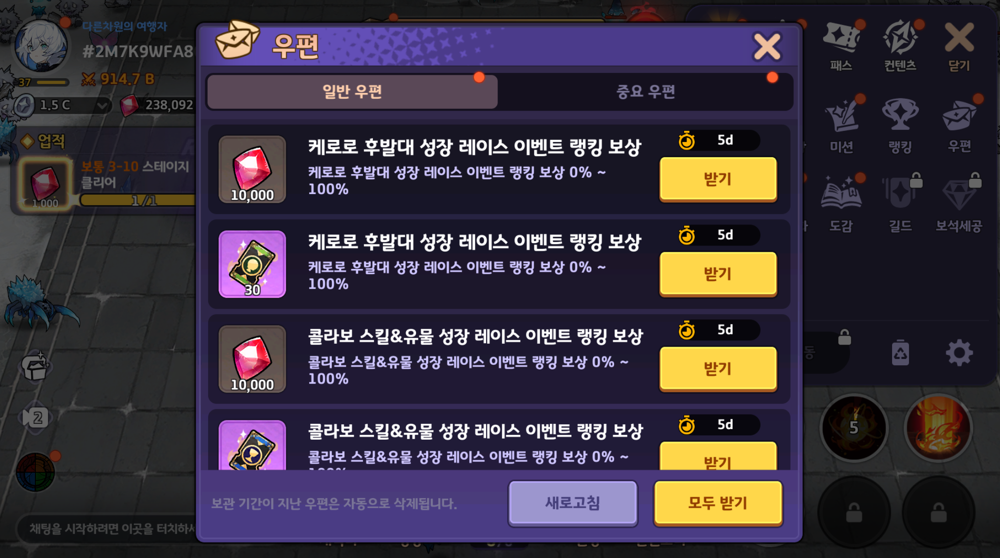
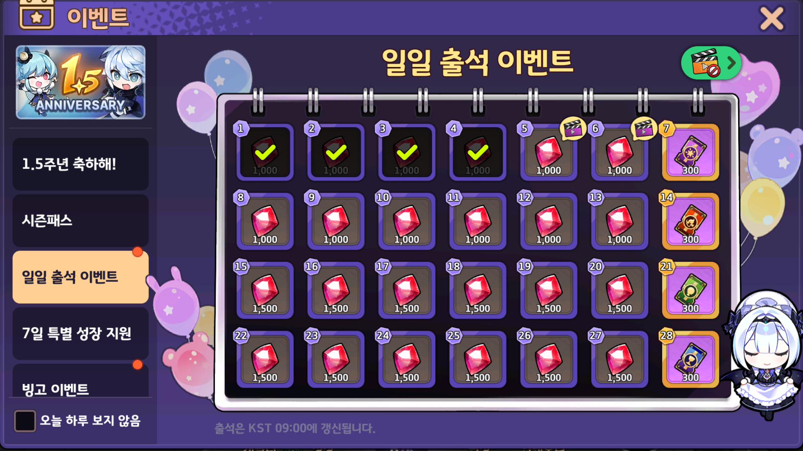
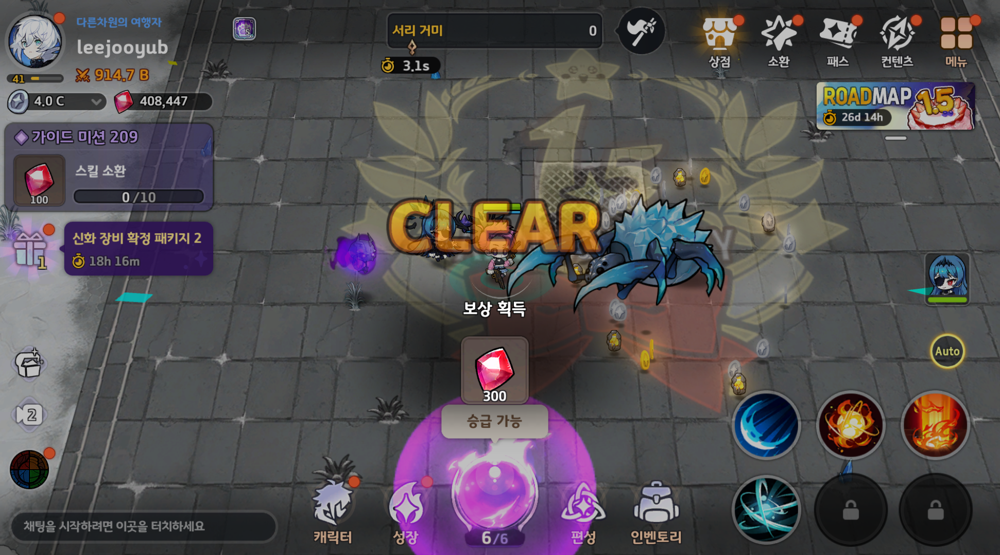
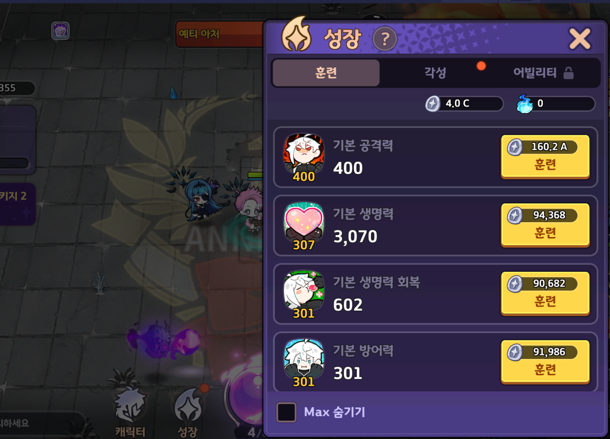
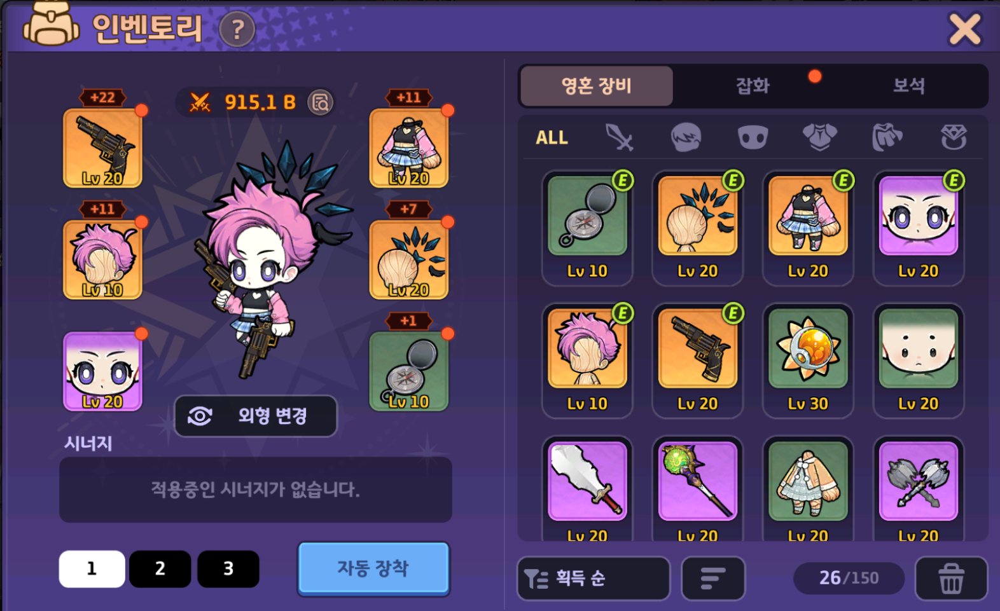

# IdleRPGServer

C#과 .NET을 활용하여 개발한 방치형 액션 RPG 서버 모작 프로젝트입니다.  
'소울 스트라이크'의 전투 및 성장 시스템을 참고하여, 개인 학습 목적으로 제작하였습니다.

---

## 🛠 기술 스택

| 항목 | 기술 |
|------|------|
| 언어 | C# |
| 프레임워크 | ASP.NET Core Web API |
| DB | MySQL|
| 캐시/인증 + 인가 | Redis |
---


## ✅ TODO-LIST: Idle RPG 서버 기능 목록

※ 각 기능은 구현 완료 시 ✅ 로 갱신합니다.
※ 서버는 **MySQL**과 **Redis**를 기반으로 구성하며, 기존 API Server Template구조를 따릅니다.

| 우선순위 | 기능 영역       | 세부 기능                           | API 호출 성공 | DB 연동 성공 | 최종 완료 |
|----------|----------------|------------------------------------|----------------|---------------|------------|
| 1        | 하이브 연동     | 하이브 계정 생성                      | ✅             |  ✅            |  ✅       |
|          |                | 하이브 로그인                        | ✅             |  ✅            |  ✅         |
|          |                | 하이브 토큰 검증                     | ✅             |  ✅            |  ✅         |
| 2        | 계정 관리       | 로그인                              | ✅             |  ✅            |  ✅         |
|          |                | 로그아웃                             | ✅             |  ✅            |  ✅         |
| 3        | 미들웨어 설정    | Redis 세션 키 불러오기                |  ✅              | ✅            | ✅           |
|          |                | 버전체크                               | ✅              | ✅           | ✅           |
| 4        | 우편함          | 우편 조회 / 보상 수령 / 삭제              | ✅             | ✅            | ✅        |
| 5        | 출석 기능       | 출석 정보 조회 / 출석 체크               | ✅             | ✅            | ✅         |
| 6       | 주 게임 컨텐츠 구현 | 스테이지 클리어, 보상 수령                      | ⬜             | ⬜            | ⬜         |
| 7        |                 | 가이드 미션 해결 (주된 파밍 수단)                    | ⬜             | ⬜            | ⬜         |
| 8       |                 | 캐릭터 체력, 공격력, 등등 훈련 (주된 성장 수단)               | ⬜             | ⬜            | ⬜         |
| 9       |                  | 인벤토리 장비 장착/해제 (주된 정비 수단)    | ⬜             | ⬜            | ⬜         |

## 기타 시스템
※ 밑에는 이후에 구현해볼 시스템 입니다
| 우선순위 | 기능 영역       | 세부 기능                           | API 호출 성공 | DB 연동 성공 | 최종 완료 |
|----------|----------------|------------------------------------|----------------|---------------|------------|
| ?         |  영혼장비 가챠 시스템    | 구슬 영혼 장비 선택 보상 시스템 구현               | ⬜             | ⬜            | ⬜         |
|          |  스킬 시스템             | 스킬 레벨 상승                        | ⬜             | ⬜            | ⬜         |
|          |                | 스킬 장착/ 해제                         | ⬜             | ⬜            | ⬜         |
|        |  기타 가챠 시스템    | 스킬, 직업 등등 가챠 시스템 구현               | ⬜             | ⬜            | ⬜         |
|        | 랭킹 시스템     | 내 랭킹 / 상위 랭킹 조회                  | ⬜             | ⬜            | ⬜         |
|          | 캐시 시스템      | 캐시샵 (패키지, 단품 아이템 구매)          | ⬜             | ⬜            | ⬜         |
|          |                | 구독 시스템 (정기 보상)                  | ⬜             | ⬜            | ⬜         |
|          | 길드 시스템     | 길드 생성 / 가입 / 탈퇴                   | ⬜             | ⬜            | ⬜         |
|          |                | 길드 콘텐츠                              | ⬜             | ⬜            | ⬜         |
|          | 서버 관리       | 서버 관리자 API (보상 지급, 유저 제재 등) | ⬜             | ⬜            | ⬜         |
|          | 친구 시스템     | 친구 목록 조회                         | ⬜             | ⬜            | ⬜         |
|          |                | 친구 요청 / 수락 / 삭제                 | ⬜             | ⬜            | ⬜         |


---


## 📌 개발 목표

- C# ASP.NET Core 기반 REST API 서버 설계
- Redis를 활용한 세션/토큰 관리
- 계정 생성 및 로그인 인증
- 게임 정보 관리 및 전투 결과 저장
- 친구, 출석, 우편 등 부가 기능 구현


---


## 📎 참고 사항
이 프로젝트는 상업적 목적이 아닌 학습을 위한 모작입니다.

실제 상용 게임과는 구조나 로직이 다를 수 있으며, 일부 기능은 축약 또는 단순화되어 있습니다.
자유롭게 참고하실 수 있지만, PR은 받고있지 않습니다.  
  


---     


# 게임 플랫폼 서버 로그인 / 로그아웃 / 토큰 유효성 검증

## UI/UX


## 시퀸스 다이어 그램

[Sequence Diagram](hiveauth.png)

## 하이브 회원가입
**컨텐츠 설명**
- 하이브에 회원 가입 합니다. 

**로직**
1. Client가 Email, PW를 보냅니다.
2. 하이브 서버가 해당 PW를 salt와 hash함수를 통해 암호화 합니다.
3. Email, Encrypted PW , Salt을 Db에 저장합니다.
4. 에러 코드를 돌려줍니다. 

**예시**
```
POST http://localhost:11501/CreateHiveAccount
Content-Type: application/json

{
    "Email" : "example@test.com",
    "Password" : "Aslj3kldiu!",
}
```

- 응답 예시

```
{
    "result": 0,
}
```


## 하이브 로그인
**컨텐츠 설명**
- 하이브에 로그인하고, 토큰을 받습니다.

**로직**
1. Client가 Email, PW를 보냅니다.
2. 하이브 서버가 해당 이메일을 통해, DB에서 해당하는 정보를 가져옵니다.
3. 가져온 Client에서 받은 pw를, db에서 가져온 Salt와 함께 해시함수에 넣어 해시를 생성 하고, 이를 db에서 가져온 Encrypted PW와 같은지 확인합니다.
4. 같다면, db.id와 TokenSalt로 해쉬함수에 넣어, HiveToken을 생성합니다.
5. id,result code, HiveToken을 돌려줍니다.

**예시**
```
POST http://localhost:11501/Login
Content-Type: application/json

{
    "Email" : "example@test.com",
    "Password" : "Aslj3kldiu!"
}
```

- 응답 예시

```
{
    "Result": 0,
    "AccountUid" : 13522,
    "Token" : "abccde"
}
```


---


# 게임 서버 로그인/로그아웃

## UI/UX


## 게임 서버 로그인
**컨텐츠 설명**
- 게임 서버에 로그인 합니다.

**로직**
1. Client가 accountuid, token를 보냅니다.
2. 게임 서버가 해당 정보를 가지고 하이브 서버에 토큰 검증을 요청합니다.
3. 게임 서버는 해당 토큰이 유효함을 알게되면, 토큰 : id를 key : value로 Redis에 저장합니다.
4. 에러 코드를 돌려줍니다.

**예시**
```
POST http://localhost:11500/Login
AppVersion: 1.0.0
MasterDataVersion: 20250725
Content-Type: application/json

{
  "AccountUid": 1,
  "Token": "6b86b273ff34fce19d6b804eff5a3f5747ada4eaa22f1d49c01e52ddb7875b4b"
}
```

- 응답 예시

```
{
    "result": 0,
}
```


## 하이브 토큰 검증
**컨텐츠 설명**
- 게임 서버에서 로그인 요청시, 하이브 서버에서 토큰을 검증합니다.

**로직**
1. 게임 서버가 하이브 서버에 토큰과 계정 id를 줍니다,
2. 하이브 서버가 해당 토큰과 id를 검증하고, errorcode로 해당 토큰이 유효함을 검증해줍니다,

**예시**
```
POST http://localhost:11501/VerifyToken
Content-Type: application/json

{
    "Token" : "example@test.com",
    "AccountUid" : "Aslj3kldiu!"
}
```

- 응답 예시

```
{
    "ErrorCode" : 0
}
```

## 게임 서버 로그아웃
**컨텐츠 설명**
- 게임 서버에서 로그아웃 합니다.

**로직**
1. Client가 Token을 보냅니다.
2. 게임 서버가 해당 Token을 key로하는 정보를Redis에서 지웁니다.

**예시**
```
POST http://localhost:11500/Logout
AppVersion: 1.0.0
MasterDataVersion: 20250725
Content-Type: application/json

{
    "Token" : "6b86b273ff34fce19d6b804eff5a3f5747ada4eaa22f1d49c01e52ddb7875b4b"
}
```

- 응답 예시

```
{
    "ErrorCode" : 0
}
```


---


# 하단의 기능들은 이제 Token도 헤더에 포함해야합니다.


---

# 우편함

## UI/UX




## 메일 리스트 새로고침
**컨텐츠 설명**
- 메일 창을 열거나, 리스트를 새로고침 합니다.

**로직**
1. Client가 서버에 토큰과 Cursor와 메일 몇개(limit)를 가져올지 요청을 보냅니다.
2. 게임 서버가 해당 토큰으로 부터 Redis를 통해 player id를 불러옵니다.
3. 커서보다 이전 범위의 메일을 limit만큼 가져오고, 마지막 메일을 커서 값을 돌려줍니다.

**예시**
```
POST http://localhost:11500/mail/list
AppVersion: 1.0.0
MasterDataVersion: 20250725
Token: e443169117a184f91186b401133b20be670c7c0896f9886075e5d9b81e9d076b
Content-Type: application/json

{
    "Cursor": "2025-07-31T00:00:00Z",
    "Limit": 10
}
```

- 응답 예시

```
{
    "Mails": [],
    "NextCursor" : "2025-07-25T00:00:00Z"
    "ErrorCode" : 0
}
``` 

## 특정 메일 보상 받기
**컨텐츠 설명**
- 하이브에 로그인하고, 토큰을 받습니다.

**로직**
1. Client가 mailid를 서버에 보냅니다
2. 서버는 헤더의 토큰을 통해 userid를 구해낸 뒤, 두 개의 id를 조합해서 특정 메일의 리워드를 특정해냅니다.
3. 해당 메일의 리워드를 받고, 해당 유저의 db를 업데이트 합니다.

**예시**
```
POST http://localhost:11501/mail/receive-reward
Content-Type: application/json
AppVersion: 1.0.0
MasterDataVersion: 20250725
Token: e443169117a184f91186b401133b20be670c7c0896f9886075e5d9b81e9d076b
Content-Type: application/json

{
    "MailId": 2,
}
```

- 응답 예시

```
{
    "RewardData": [],
    "ErrorCode" : 0
}
``` 

---

# 출석부

## UI/UX




## 출석 체크
**컨텐츠 설명**
- 특정 출석부에 출석 체크를 합니다.

**로직**
1. Client가 출석부 id와 출석할 날짜 (순번) 값을 보냅니다.
2. 서버는 해당 요청이 타당한가 여러가지 체크를 합니다 (출석부 유효성, 갱신 시간이 이후인지,)
3. 해당 출석에 해당하는 결과를 받습니다.

**예시**
```
POST http://localhost:11501/attendance/check-today
Content-Type: application/json
AppVersion: 1.0.0
MasterDataVersion: 20250725
Token: e443169117a184f91186b401133b20be670c7c0896f9886075e5d9b81e9d076b
Content-Type: application/json

{
  "AttendanceBookId": 1,
  "CheckNthDay" : 3
}
```

- 응답 예시

```
{
    "RewardData": [], 
    "ErrorCode" : 0
}
``` 

---


# 메인 스테이지 로직

## UI/UX




## 스테이지 클리어
**컨텐츠 설명**
- 매 스테이지를 클리어할 때마다 보상을 받습니다.

<!-- 
**로직**
1. Client가 출석부 id와 출석할 날짜 (순번) 값을 보냅니다.
2. 서버는 해당 요청이 타당한가 여러가지 체크를 합니다 (출석부 유효성, 갱신 시간이 이후인지,)
3. 해당 출석에 해당하는 결과를 받습니다.

**예시**
```
POST http://localhost:11501/attendance/check-today
Content-Type: application/json
AppVersion: 1.0.0
MasterDataVersion: 20250725
Token: e443169117a184f91186b401133b20be670c7c0896f9886075e5d9b81e9d076b
Content-Type: application/json

{
  "AttendanceBookId": 1,
  "CheckNthDay" : 3
}
```

- 응답 예시

```
{
    "RewardData": [], 
    "ErrorCode" : 0
}
```  -->

## UI/UX


## 가이드 미션 클리어 
**컨텐츠 설명**
- 가이드 미션을 클리어하고, 보상을 받습니다.


<!--
**로직**
1. Client가 출석부 id와 출석할 날짜 (순번) 값을 보냅니다.
2. 서버는 해당 요청이 타당한가 여러가지 체크를 합니다 (출석부 유효성, 갱신 시간이 이후인지,)
3. 해당 출석에 해당하는 결과를 받습니다.

**예시**
```
POST http://localhost:11501/attendance/check-today
Content-Type: application/json
AppVersion: 1.0.0
MasterDataVersion: 20250725
Token: e443169117a184f91186b401133b20be670c7c0896f9886075e5d9b81e9d076b
Content-Type: application/json

{
  "AttendanceBookId": 1,
  "CheckNthDay" : 3
}
```

- 응답 예시

```
{
    "RewardData": [], 
    "ErrorCode" : 0
}
```  -->


# 성장 시스템
## UI/UX




## 캐릭터 능력 업그레이드 화면
**컨텐츠 설명**
- 캐릭터의 특정 능력을 올립니다.

<!--
**로직**
1. Client가 출석부 id와 출석할 날짜 (순번) 값을 보냅니다.
2. 서버는 해당 요청이 타당한가 여러가지 체크를 합니다 (출석부 유효성, 갱신 시간이 이후인지,)
3. 해당 출석에 해당하는 결과를 받습니다.

**예시**
```
POST http://localhost:11501/attendance/check-today
Content-Type: application/json
AppVersion: 1.0.0
MasterDataVersion: 20250725
Token: e443169117a184f91186b401133b20be670c7c0896f9886075e5d9b81e9d076b
Content-Type: application/json

{
  "AttendanceBookId": 1,
  "CheckNthDay" : 3
}
```

- 응답 예시

```
{
    "RewardData": [], 
    "ErrorCode" : 0
}
```  -->

# 인벤토리 장비 탈/부착
## UI/UX




## 인벤토리 장비 탈/부착
**컨텐츠 설명**
- 인벤토리 장비 (무기,머리,옷,장식,표정,장신구)

<!--
**로직**
1. Client가 출석부 id와 출석할 날짜 (순번) 값을 보냅니다.
2. 서버는 해당 요청이 타당한가 여러가지 체크를 합니다 (출석부 유효성, 갱신 시간이 이후인지,)
3. 해당 출석에 해당하는 결과를 받습니다.

**예시**
```
POST http://localhost:11501/attendance/check-today
Content-Type: application/json
AppVersion: 1.0.0
MasterDataVersion: 20250725
Token: e443169117a184f91186b401133b20be670c7c0896f9886075e5d9b81e9d076b
Content-Type: application/json

{
  "AttendanceBookId": 1,
  "CheckNthDay" : 3
}
```

- 응답 예시

```
{
    "RewardData": [], 
    "ErrorCode" : 0
}
```  -->

---
