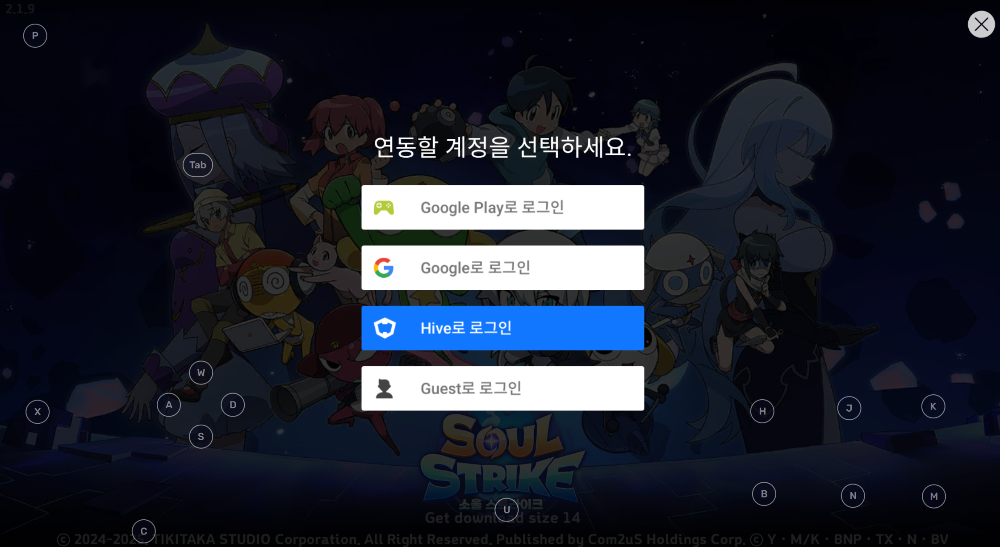
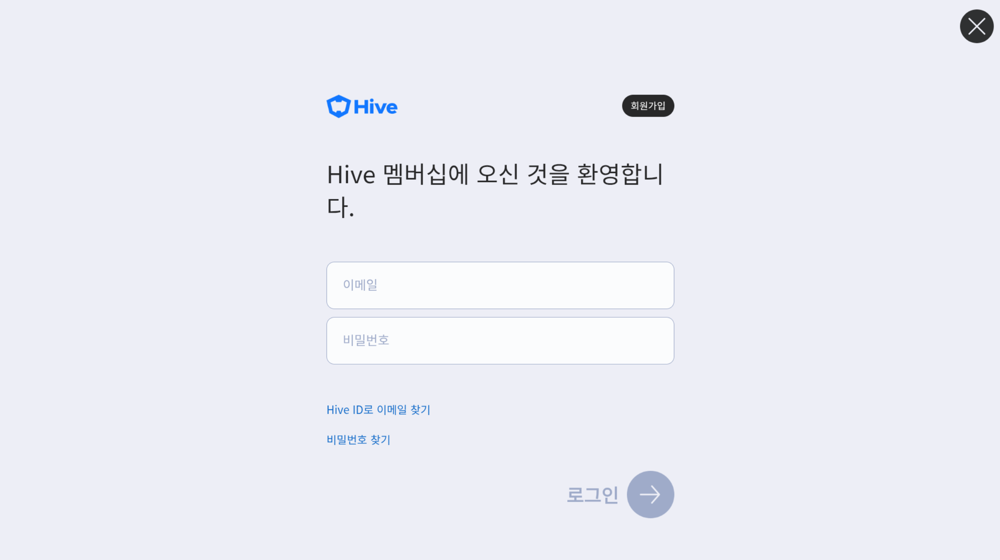
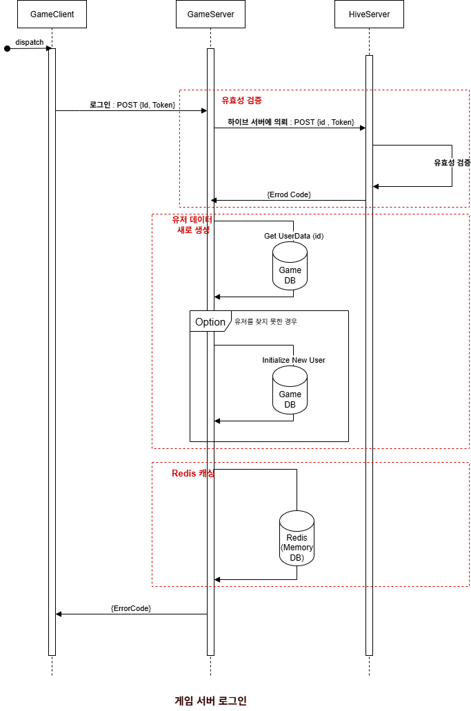

# IdleRPGServer

C#과 .NET을 활용하여 개발한 방치형 액션 RPG 서버 모작 프로젝트입니다.  
'소울 스트라이크'의 전투 및 성장 시스템을 참고하여, 개인 학습 목적으로 제작하였습니다.

---

## 🛠 기술 스택

| 항목 | 기술 |
|------|------|
| 언어 | C# |
| 프레임워크 | ASP.NET Core Web API |
| DB | MySQL|
| 캐시/인증 + 인가 | Redis |
---


## ✅ TODO-LIST: Idle RPG 서버 기능 목록

※ 각 기능은 구현 완료 시 ✅ 로 갱신합니다.
※ 서버는 **MySQL**과 **Redis**를 기반으로 구성하며, 기존 API Server Template구조를 따릅니다.

| 우선순위 | 기능 영역       | 세부 기능                           | API 호출 성공 | DB 연동 성공 | 최종 완료 |
|----------|----------------|------------------------------------|----------------|---------------|------------|
| 1        | 하이브 연동     | 하이브 계정 생성                      | ✅             |  ✅            |  ✅       |
|          |                | 하이브 로그인                        | ✅             |  ✅            |  ✅         |
|          |                | 하이브 토큰 검증                     | ✅             |  ✅            |  ✅         |
| 1        | 계정 관리       | 로그인                              | ✅             |  ✅            |  ✅         |
|          |                | 로그아웃                             | ✅             |  ✅            |  ✅         |
| 1        | 미들웨어 설정    | Redis 세션 키 불러오기                |  ✅              | ✅            | ✅           |
|          |                | 버전체크                               | ✅              | ✅           | ✅           |
| 2        | 우편함          | 우편 조회 / 보상 수령 / 삭제              | ✅             | ✅            | ✅         |
| 2        | 출석 기능       | 출석 정보 조회 / 출석 체크               | ⬜             | ⬜            | ⬜         |
| 2        | 친구 시스템     | 친구 목록 조회                         | ⬜             | ⬜            | ⬜         |
|          |                | 친구 요청 / 수락 / 삭제                 | ⬜             | ⬜            | ⬜         |
| 3        | 유저 데이터 로드  | 화폐 , 인벤토리                    | ✅             | ⬜            | ⬜         |
|          |                | 캐릭터 능력                    | ⬜             | ⬜            | ⬜         |
| 3        | 유저 데이터 업데이트  | 화폐 , 인벤토리                    | ✅             | ⬜            | ⬜         |
|          |                | 캐릭터 능력                    | ⬜             | ⬜            | ⬜         |
| 3        | 게임 데이터 로드 | 버전 데이터                     | ✅             | ✅            | ✅         |
|          |                | 기타 게임 데이터                       | ⬜             | ⬜            | ⬜       |
| 3        | 가챠 시스템     | 스킬 가챠               | ⬜             | ⬜            | ⬜         |
|          |                | 아이템 가챠          | ⬜             | ⬜            | ⬜         |
|          |                | 직업 가챠                       | ⬜             | ⬜            | ⬜         |
|          |                | 수정구 스킬 뽑기              | ⬜             | ⬜            | ⬜         |
| 3        | 게임 시스템     | 보너스 스테이지 진입 / 게임 결과 저장           | ⬜             | ⬜            | ⬜         |
| 3        | 성장 시스템     | 스킬 장착 / 해제 / 레벨업                | ⬜             | ⬜            | ⬜         |
|          |                | 어빌리티 강화 (공격력, 체력 등)          | ⬜             | ⬜            | ⬜         |
|          |                | 인벤토리 관리                         | ⬜             | ⬜            | ⬜         |
|          |                | 구슬 선택 보상 시스템 구현               | ⬜             | ⬜            | ⬜         |
| 4        | 랭킹 시스템     | 내 랭킹 / 상위 랭킹 조회                  | ⬜             | ⬜            | ⬜         |
| 4        | 캐시 시스템      | 캐시샵 (패키지, 단품 아이템 구매)          | ⬜             | ⬜            | ⬜         |
|          |                | 구독 시스템 (정기 보상)                  | ⬜             | ⬜            | ⬜         |
| 5        | 길드 시스템     | 길드 생성 / 가입 / 탈퇴                   | ⬜             | ⬜            | ⬜         |
|          |                | 길드 콘텐츠                              | ⬜             | ⬜            | ⬜         |
| 5        | 시스템 관리     | 마스터 데이터 버전 검증                   | ⬜             | ⬜            | ⬜         |
|          |                | 서버 관리자 API (보상 지급, 유저 제재 등) | ⬜             | ⬜            | ⬜         |


---


## 📌 개발 목표

- C# ASP.NET Core 기반 REST API 서버 설계
- Redis를 활용한 세션/토큰 관리
- 계정 생성 및 로그인 인증
- 게임 정보 관리 및 전투 결과 저장
- 친구, 출석, 우편 등 부가 기능 구현


---


## 📎 참고 사항
이 프로젝트는 상업적 목적이 아닌 학습을 위한 모작입니다.

실제 상용 게임과는 구조나 로직이 다를 수 있으며, 일부 기능은 축약 또는 단순화되어 있습니다.
자유롭게 참고하실 수 있지만, PR은 받고있지 않습니다.  
  


---     


# 게임 플랫폼 서버 로그인/로그아웃

## UI/UX





## 시퀸스 다이어 그램

[Sequence Diagram](hiveauth.png)

## 하이브 회원가입
**컨텐츠 설명**
- 하이브에 회원 가입 합니다. 

**로직**
1. Client가 Email, PW를 보냅니다.
2. 하이브 서버가 해당 PW를 salt와 hash함수를 통해 암호화 합니다.
3. Email, Encrypted PW , Salt을 Db에 저장합니다.
4. 에러 코드를 돌려줍니다. 

**예시**
```
POST http://localhost:11501/CreateHiveAccount
Content-Type: application/json

{
    "email" : "example@test.com",
    "password" : "Aslj3kldiu!",
}
```

- 응답 예시

```
{
    "result": 0,
}
```


## 하이브 로그인
**컨텐츠 설명**
- 하이브에 로그인하고, 토큰을 받습니다.

**로직**
1. Client가 Email, PW를 보냅니다.
2. 하이브 서버가 해당 이메일을 통해, DB에서 해당하는 정보를 가져옵니다.
3. 가져온 Client에서 받은 pw를, db에서 가져온 Salt와 함께 해시함수에 넣어 해시를 생성 하고, 이를 db에서 가져온 Encrypted PW와 같은지 확인합니다.
4. 같다면, db.id와 TokenSalt로 해쉬함수에 넣어, HiveToken을 생성합니다.
5. id,result code, HiveToken을 돌려줍니다.

**예시**
```
POST http://localhost:11501/Login
Content-Type: application/json

{
    "Email" : "example@test.com",
    "Password" : "Aslj3kldiu!"
}
```

- 응답 예시

```
{
    "result": 0,
    "plyerId" : 13522,
    "hiveToken" : "abccde"
}
```

---

# 게임 서버 로그인 (자동 로그인) (구현중)

## UI/UX


<!--  -->


## 시퀸스 다이어 그램

[Sequence Diagram](gameauth.png)

<!-- ## 게임 서버 로그인
**컨텐츠 설명**
- 하이브에 첫 로그인 성공 이후, 게임 서버에 로그인을 합니다.

**로직**
1. Client가 기기에 Cache에 저장된 id와 hivetoken을 게임 서버에 보냅니다.
2. 게임 서버가 해당 토큰을 hive server에 유효한 것인지 검증을 부탁합니다.
3. 유효한 토큰일 경우, 해당 유저의 id에 대한 userinfo 를 불러오거나 새로 만듭니다.
4. game server token을 발행하고, 이를 redis에 저장합니다.
5. id, user info, game server token, error code를 돌려줍니다.

**예시**
```
POST http://localhost:11500/Login
Content-Type: application/json

{
    "email" : "example@test.com",
    "password" : "Aslj3kldiu!",
}
```

- 응답 예시

```
{
    "result": 0,
}
``` -->


## 게임 서버 로그아웃 (구현중)
<!-- **컨텐츠 설명**
- 하이브에 로그인하고, 토큰을 받습니다.

**로직**
1. Client가 Email, PW를 보냅니다.
2. 하이브 서버가 해당 이메일을 통해, DB에서 해당하는 정보를 가져옵니다.
3. 가져온 Client에서 받은 pw를, db에서 가져온 salt와 함쎄 해쉬를 하고, 이게, db에서 가져온 pw와 같은지 확인합니다.
4. 같다면, db.id와 token을 위한 salt로 해쉬함수에 넣어, 토큰을 생성합니다.
5. 토큰을 돌려줍니다.

**예시**
```
POST http://localhost:11501/Login
Content-Type: application/json

{
    "Email" : "example@test.com",
    "Password" : "Aslj3kldiu!"
}
```

- 응답 예시

```
{
    "result": 0,
    "plyerId" : 13522,
    "hiveToken" : "abccde"
}
``` -->


